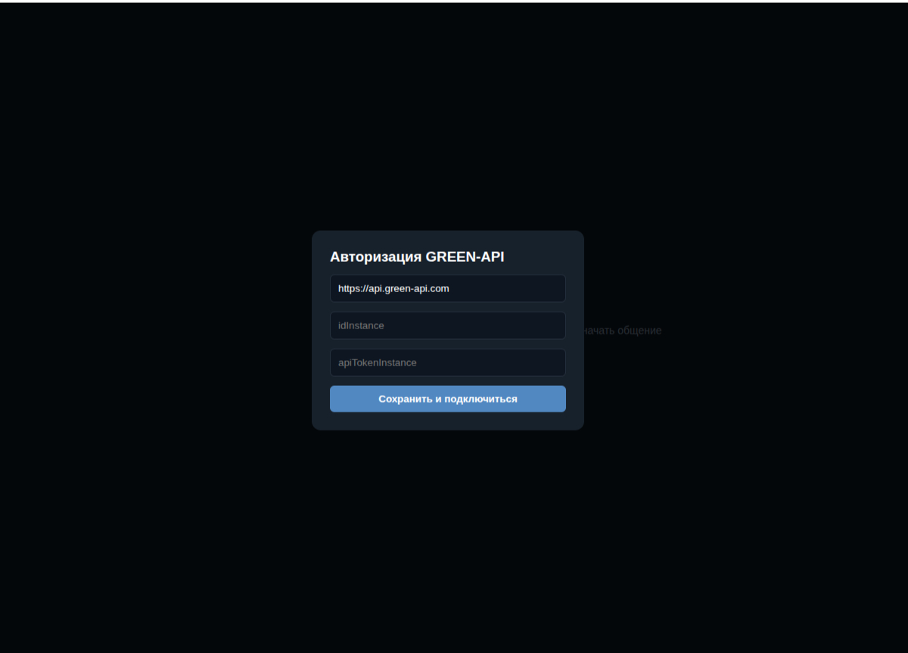

# Mock TG Web App

Live - https://al3xsus.github.io/tg-mock/

Стек - React, TypeScript, Vite

## Чтобы запустить:

`npm i`

`cp .env.example .env.local` и указать VITE_API_URL (в нашем случае https://api.green-api.com)

`npm run dev`

## Чтобы начать работу

* Откройте приложение в браузере (по умолчанию http://localhost:5173).
* В появившемся окне введите свои `idInstance` и `apiTokenInstance` из личного кабинета GREEN-API.
* Нажмите кнопку + в боковой панели, чтобы открыть окно создания чата.
* Введите Telegram ID получателя.
    * как узнать Telegram ID:
        * Свой - через бота [@getmyid_bot](https://t.me/getmyid_bot)
        * Другого человека - через ботов [@userinfobot](https://t.me/userinfobot) или [@username_to_id_bot](https://t.me/username_to_id_bot)
* Напишите текст в поле ввода и нажмите Enter или кнопку отправки.
* При получении ответа от собеседника из Telegram сообщение автоматически отобразится в окне чата.

## Скриншоты

Модальное окно ввода данных

Пустое окно

Модальное окно создания чата

Чат активен
